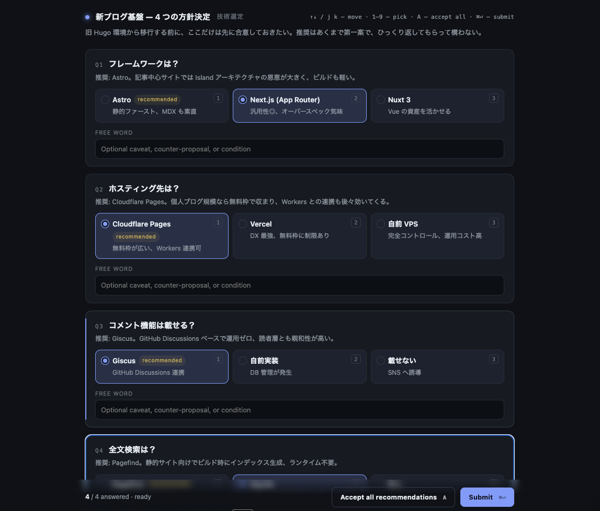

# claude-case

[English](./README.md) · [日本語](./README.ja.md)

[Claude Code](https://claude.ai/code) が「1. Xする？ 2. Yする？ 3. …」のように複数の選択肢を並べてきたとき、チャットで `1,2,1 あと2はXで` と返すのが面倒。これをブラウザ UI に置き換える Skill (`/case`) です。



カードをクリックして選び、必要なら質問ごとに「Free word」で補足を添え、**Submit** を押すと agent に構造化 JSON が返り制御が戻ります。

## インストール

[GitHub CLI](https://cli.github.com/) **v2.90.0+** が必要です（`gh skill` 同梱、2026-04-16 リリース）。

```bash
gh skill install TeXmeijin/claude-case case --agent claude-code --scope user
```

`~/.claude/skills/case/` に展開されます。以降 Claude Code が自動的にこの Skill を見つけて複数択の質問で呼び出すほか、`/case` で手動起動もできます。

### 手動インストール（`gh skill` を使わない場合）

```bash
git clone https://github.com/TeXmeijin/claude-case.git
cp -r claude-case/skills/case ~/.claude/skills/
```

## 使い方

基本は Claude Code が状況判断で勝手に起動します。明示的に使いたい場合は `/case` と打つか、「**/case で聞いて**」のように依頼してください。

UI の構成:

- 選択肢 1 つにつきカード 1 枚。推奨の選択肢には小さな `recommended` バッジ。
- 各質問の下に **Free word** 入力欄 — 「ただし〜」「代案として〜」などを短文で。
- 画面下部の **Notes** — 全体に対する補足、方向転換、横道の議論など。

### キーボード操作

| キー                    | 動作                    |
| --------------------- | --------------------- |
| `↑` / `↓` / `j` / `k` | 質問を上下に移動              |
| `1`〜`9`               | n 番目の選択肢を選ぶ           |
| `A`                   | すべて推奨で受け入れる           |
| `⌘ ↩`                 | 送信                   |

すべての質問に回答するまで Submit は押せません。

## 仕組み

1. Claude Code が質問・選択肢・推奨値を JSON で組み立てる。
2. Skill が `decide.py` をバックグラウンド起動 → ローカル HTTP サーバが立ち、ブラウザが自動で開く。
3. ユーザが UI で回答して Submit。
4. サーバが結果 JSON をファイルに書いて終了。Claude Code がそれを読み、続きを進める。

[`crit`](https://crit.md/) と同じブロッキング型の制御戻しです。

## 入力スキーマ

```jsonc
{
  "title": "短いヘッダ",
  "tag": "任意のカテゴリ",
  "intro": "任意の前書き",
  "questions": [
    {
      "id": "安定 ID",
      "title": "質問本文",
      "reason": "推奨の根拠を 1 行で（質問の直下に表示）",
      "options": [
        { "label": "選択肢 A", "note": "補足", "recommended": true },
        { "label": "選択肢 B", "note": "トレードオフ" }
      ],
      "allowFreeText": true
    }
  ]
}
```

## 出力スキーマ

```jsonc
{
  "version": 1,
  "answers": [
    {
      "id": "安定 ID",
      "selectedLabel": "選択肢 A",
      "wasRecommended": true,
      "freeText": "質問ごとの補足 or null"
    }
  ],
  "notes": "全体コメント or null",
  "submittedAt": "ISO タイムスタンプ"
}
```

## ローカル開発

```bash
git clone https://github.com/TeXmeijin/claude-case.git
cd claude-case
python3 skills/case/decide.py skills/case/sample.json
```

作業中のコピーをそのまま Skill として入れる場合:

```bash
gh skill install ./ case --from-local --agent claude-code --scope user --force
```

## ライセンス

MIT
