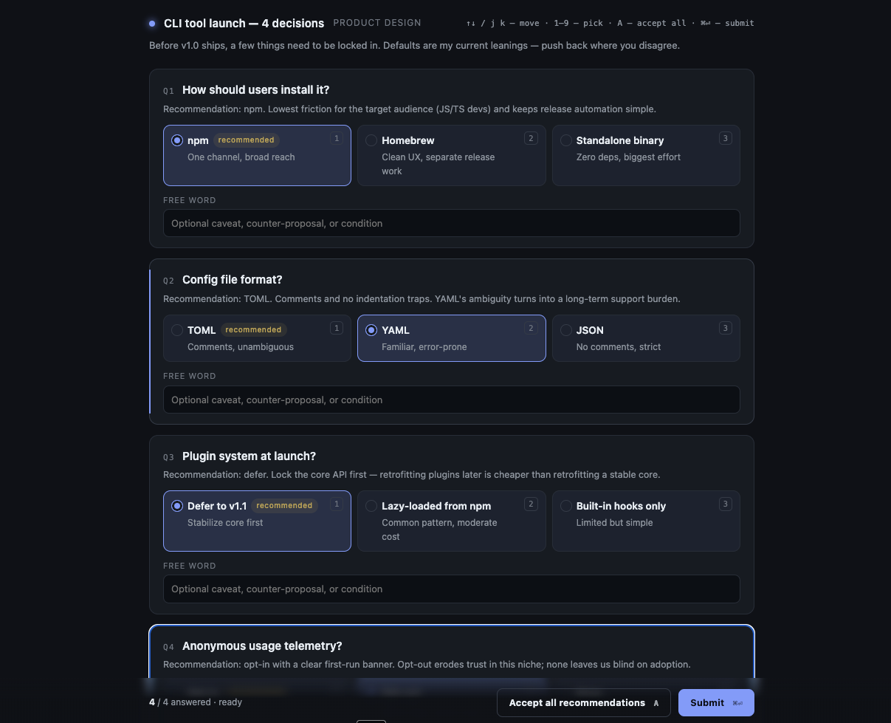

# claude-case

[English](./README.md) · [日本語](./README.ja.md)

A [Claude Code](https://claude.ai/code) skill (`/case`) that replaces plain-prompt multiple-choice questions with a polished browser UI.



When an agent needs to confirm several design decisions at once, typing `1, 2, 1, and also for #2 I want X` in chat is tedious and error-prone. `/case` pops open a local web page: click to select, optionally add a per-question *free word* override, hit **Submit** — control returns to the agent with a structured JSON result.

## Install

Requires [GitHub CLI](https://cli.github.com/) **v2.90.0+** (which ships `gh skill`, released 2026-04-16).

```bash
gh skill install TeXmeijin/claude-case case --agent claude-code --scope user
```

That installs the skill into `~/.claude/skills/case/`. Claude Code discovers it automatically and will invoke it when it has multiple-choice decisions to confirm — or you can invoke it manually with `/case`.

### Manual install (no `gh skill`)

```bash
git clone https://github.com/TeXmeijin/claude-case.git
cp -r claude-case/skills/case ~/.claude/skills/
```

## Using it

Claude Code triggers the skill on its own when a decision flow matches. To force it for a single turn, type `/case` or ask: *"Use /case to ask me."*

The UI:

- One card per option; the recommended option carries a small `recommended` badge.
- Per-question **Free word** field — a short caveat or counter-proposal that layers on top of the selection.
- Shared **Notes** field at the bottom for overall remarks.

### Keyboard

| Key            | Action                         |
| -------------- | ------------------------------ |
| `↑` / `↓` / `j` / `k` | Move between questions  |
| `1`–`9`        | Pick the nth option            |
| `A`            | Accept all recommended options |
| `⌘ ↩`          | Submit                         |

Submit is disabled until every question has an answer.

## How it works

1. Claude Code prepares a JSON document describing the questions, options, and recommended defaults.
2. The skill runs `decide.py` in the background, which starts a local HTTP server and opens your browser.
3. You answer in the UI and submit.
4. The server writes the result JSON to disk, exits, and Claude Code reads the file.

Same blocking pattern as [`crit`](https://crit.md/).

## Input schema

```jsonc
{
  "title": "Short header",
  "tag": "optional category",
  "intro": "optional preamble",
  "questions": [
    {
      "id": "stable-id",
      "title": "The question",
      "reason": "One-line rationale shown under the title",
      "options": [
        { "label": "Choice A", "note": "short detail", "recommended": true },
        { "label": "Choice B", "note": "tradeoff" }
      ],
      "allowFreeText": true
    }
  ]
}
```

## Output schema

```jsonc
{
  "version": 1,
  "answers": [
    {
      "id": "stable-id",
      "selectedLabel": "Choice A",
      "wasRecommended": true,
      "freeText": "optional caveat, or null"
    }
  ],
  "notes": "optional overall notes, or null",
  "submittedAt": "ISO timestamp"
}
```

## Local development

```bash
git clone https://github.com/TeXmeijin/claude-case.git
cd claude-case
python3 skills/case/decide.py skills/case/sample.json
```

To install your working copy as a skill:

```bash
gh skill install ./ case --from-local --agent claude-code --scope user --force
```

## License

MIT
